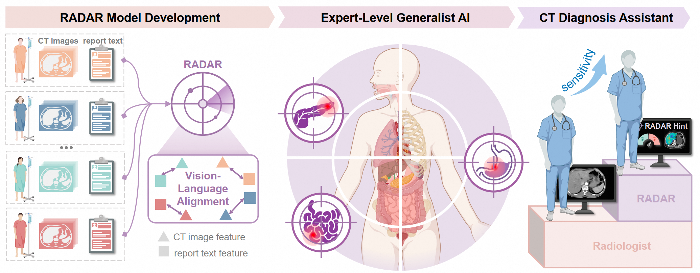

# RADAR: An Expert-Level Generalist AI for Abdominal CT Diagnosis

[](https://github.com/alibaba-damo-academy/damo-radar)
[](https://huggingface.co/radar-generalist)
[](https://zenodo.org/records/20437705)


RADAR is a generalist vision-language model trained on over 400,000 contrast-enhanced abdominal CT examinations with 15 million anatomy-aware image–text pairs, learning directly from clinical reports without manual annotation. RADAR provides a scalable and versatile framework for radiology AI, demonstrating expert-level performance across both routine and complex clinical tasks.

<p align="center">
  
</p>

---

## Setup

Create a conda environment and install the required dependencies:

```bash
conda create -n radar python=3.10
conda activate radar
pip install -r requirements.txt
```

---

## HuggingFace

- The pre-trained checkpoints and supporting files are available on [HuggingFace](https://huggingface.co/radar-generalist).
- For convenience, we have provided the demo nifty, processed Merlin-related reports and labels, and predicted results in CSV format in this repo. The supporting files required for the inference demo and training can be downloaded from HuggingFace.

---
## Zenodo
Code can also be archived on [Zenodo](https://zenodo.org/records/20437705).

---


## Documentation

For detailed instructions, please refer to the following guides:

| Guide                         | Description                                                                                                                               |
| ----------------------------- | ----------------------------------------------------------------------------------------------------------------------------------------- |
| [Training](docs/TRAINING.md)   | Train RADAR/RADAR+ from scratch or fine-tune on MERLIN data; inference and evaluation are also included.                                                   |
| [Inference](docs/INFERENCE.md) | 1. An inference demo with a radar pre-trained checkpoint on RAD-CT, and 2. Inference and evaluation of radar performance on the external MERLIN test set. |

---

## Citation

If you find RADAR useful in your research, please cite our paper:

```bibtex
@article{radar,
  title   = {RADAR: An Expert-Level Generalist AI for Abdominal CT Diagnosis},
  year    = {2026},
  note    = {BibTeX entry to be updated upon publication}
}
```
